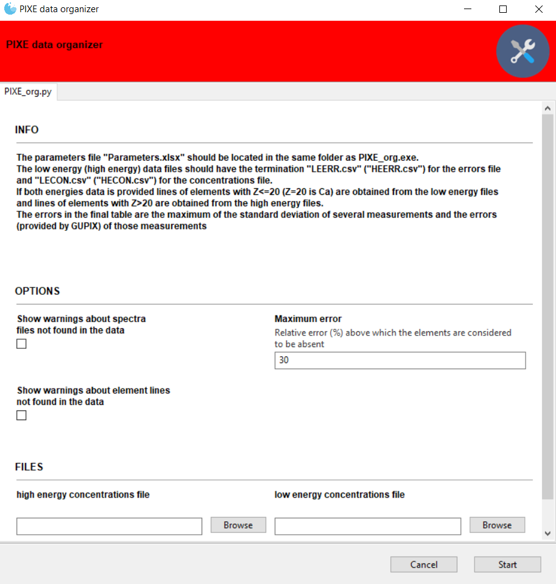
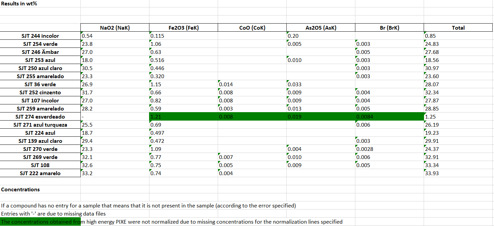

# Doc PIXEorg

##  1.	Introduction
PIXEorg is a simple program created to organize and show in an excel (.xlsx) file concentrations obtained after fitting PIXE spectra with GUPIXWIN in batch mode. Due to the variation of the X-ray production cross sections with the energy of the exciting beam, and to optimize the detection of the high mass trace elements with very low x-ray emission intensities, two irradiations are usually performed with different energies of the exciting ion beam. From the low energy analysis, the user obtains the concentrations of lower mass elements, and from the high energy analysis the concentrations of higher mass elements. After each irradiation the resulting spectra are fitted with GUPIXWIN and a set of comma delimited (.csv) files with the concentrations of the several elements and their relative errors is produced. The complete set of csv files (from both energy regimes) is read by PIXEorg which organizes and selects the useful data to produce a final excel (.xlsx) table with the concentrations of elements or compounds of interest and their respective errors.

## 2. How does it work?
<figure align="center">
  
  <figcaption>Figure 1 - Graphical User Interface of PIXE_org.</figcaption>
</figure>
 
 

### 2.1	Required files
 

#### 2.1.1 Parameters file
A parameters file called "Parameters.xlsx" must be in the same folder as the PIXEorg executable. This Parameters excel file has:   
  - a sheet called "filesID" which contains a list of the spectra files associated with the sample to which they correspond to, written in no special order and independent of the energy type analysis. Several spectra files (of the same energy regime) can be associated with one sample. When this is the case the several measurements of each line are averaged to obtain the final average concentrations. The associated analysis error is calculated as the standard deviation of the several measurements except if the elemental fitting and statistical error from GUPIX analysis presents a higher value.   
  -	a sheet called "Compounds" where the user lists the elements and compounds (oxides) whose mass concentrations are required.   
  -	a sheet called "NormalizationLines" where the lines that should be used to normalize the high energy data are indicated. Each line to use is indicated by the element chemical symbol and the line identifier (Siegbahn notation), separated by a forward slash “/”. The line identifier **must** match with the one used by GUPIXWIN in the csv files. Please check the notation used in those files. **P.S. -** this element normalization is required if the beam accumulated charge could not be properly accounted for and 100% normalization was chosen for GUPIX analysis.  
  -	a sheet called "ElementsTable" with the atomic number and mass of many elements. If an element is indicated in the "Compounds" sheet, then its information (Z and mass) must be added to the "ElementsTable" sheet. 
  
In all these sheets comments can be added to the top, in the first column (only in the top, before any data, and only to the first column). If a cell is meant for a comment the content of the cell must start with ‘#’. 
 
 

#### 2.1.2 Data files
After fitting a set of PIXE spectra GUPIXWIN records the results in several comma delimited (.csv) files. One of these files has the mass concentration (in PPM) for each analyzed x-ray line (the conversion of x-ray intensities to mass content in the sample), for each analyzed sample. There is also a correspondent errors file that has the relative error (in %) of each mass concentration that was calculated and presented in the concentrations file.  
As mentioned in the introduction section if both low mass and high mass elements are present in the samples analyzed then two irradiations are usually performed with different energies of the exciting ion beam. If this is the case, then for each experiment there will be an output of a concentration file and a correspondent errors file. PIXEorg uses the low energy (LE) csv files to read the concentrations and errors of elements with Z≤20 and the high energy (HE) csv files to read the concentrations and errors of elements with Z>20. After launching PIXE_org.exe the path to both concentrations file should be provided (the file selection fields of the GUI can be seen at the bottom of figure 1). The errors file should be in the same path as the correspondent concentrations file. **For the program to work correctly the name of the high energy (low energy) concentrations file should end in "HECON.csv" ("LECON.csv") and the name of high energy (low energy) errors file should end in "HEERR.csv" ("LEERR.csv"). Notice that the default terminations provided by GUPIXWIN when the csv files are created are "CON.csv" and "ERR.csv". The user must add the "HE" or "LE" according to the energy regime of the data.**  
If the user only wants to use the data from one energy regime then it is okay to provide only one path for a concentrations file in the file selection fields shown at the bottom of the GUI in figure 1. In this case either the high energy or the low energy fields can be used to provide the path, regardless of the experimental energy of the exciting beam, while leaving the other field empty. **The termination of the files must however be set accordingly to the field used.** Both the high and low mass element lines data are then read from the concentrations and errors files provided. In this case the high energy data will not be normalized.
 
 
 
 
 
### 2.2	Output
The output of the program is an excel file (FinalTable.xslx) with two sheets. In the first sheet there is a table with the mass concentrations, in %, of each element or oxide of interest for each sample (figure 2). If an element/oxide is deemed not to be part of the composition (according to the criterium presented in “Selection of lines” below) then it has a blank entry. The final column of this table shows the sum of all the mass concentrations of the elements/oxides for each sample. If all the elements/oxides that take part in the composition are considered this sum should be close to 100%. Along with each element/oxide name there is the indication of the line used to obtain the concentrations.

The second sheet has a table that is the same as the one in the first sheet but with the errors of each concentration presented and without the sum of all the concentrations in each sample. The errors are obtained according to what is presented in the subsection “Statistics and errors” of the section 2.3 “Execution”. 
 
 
 
 
 
### 2.3	Execution
 

#### 2.3.1 Selection of lines
A valid line intensity measurement (turned into mass concentration data) must have an error smaller than a threshold defined by the user. This threshold is by default 30% and its value is set in the GUI ("Maximum error" field in the "OPTIONS" section in figure 1). If a line has an error greater than this threshold then it is not usable. If all the line measurements that correspond to a given element (of interest) for some sample are unusable then the entry for this element/sample will be blank in the results tables.  
If more than 1 line was measured and fitted for a given element of interest the user will be prompted to choose the lines that he wants to use (for example if both the K and the L lines were measured). Each line chosen will provide a different estimation of the concentration of the element or respective oxide (in all the samples). Along with each element/oxide name there is the indication of the line used to obtain the concentrations (figure 2). Be aware that if more than 1 line is chosen the sum of all the concentrations for each sample will deviate (even more) from 100% since there will be more than 1 estimate for the same element/oxide.  
 
 

#### 2.3.2 Statistics and errors
If many PIXE spectra for a sample are acquired and fitted with GUPIXWIN (within the same energy regime) many concentration values deduced from the same line will be available. When this is the case, all the valid concentrations (according to the error criterion defined above in “Selection of data”) will be averaged to determine the corresponding element's concentration. The error for this concentration will be the maximum of:

-	the standard deviation of the concentrations if more than 1 valid value is available to average.
-	the maximum of the individual errors of the (valid) concentrations averaged, provided by GUPIXWIN.
 
 

#### 2.3.3 Normalization of concentrations
The ratios of concentrations obtained at a low energy and the concentrations obtained at a higher energy, are calculated for each line specified in the “NormalizationLines” sheet in “Parameters.xlsx”. These ratios are then averaged to create a normalization factor which multiplies all the concentrations obtained from the high energy experiment (Z>20). If possible, only valid lines are used in this calculation (see point 1 below). Each line to use is indicated in the “Parameters.xlsx” file by the element chemical symbol and the line identifier (Siegbahn notation) separated by a forward slash “/”. The line identifier **must** match with the one used by GUPIXWIN in the csv files for the concentrations/errors. Please check the notation used in those files.  
For a given sample, the following situations may take place, and will be properly identified in the results table:  
-	all the lines specified for normalization have a relative error greater than the threshold specified, for at least one of the energy regimes. This means that the normalization factor must be calculated with invalid lines. If this is the case the concentrations obtained at high energy (Z>20) are still normalized but these concentrations are highlighted in yellow in the results table. 
-	there is no low energy data available and therefore the high energy concentrations cannot be normalized. If this is the case the concentrations are highlighted in green in the results table.
 
 

#### 2.3.4 From elements to compounds concentrations
This program was written having in mind the two simplest cases for presenting mass concentrations. The concentration of an element is either presented in its simple elemental form or in the form of an oxide. If an oxide formula is provided in the parameters file, the program simply obtains the mass concentration of the element that was analyzed with PIXE (which in principle is only one in the oxide) and multiplies it by the appropriate factor to get the oxide’s concentration value.  
Besides oxides any other compounds can also be considered. However, the standard is that each compound only has one element whose lines were measured.  In the remote possibility that the user intends to obtain the concentration of a compound which is formed by several elements whose line intensities were measured and fitted by GUPIXWIN, the results table will have different calculations for such compound, using the different elements that compose it. For example, if the user wants to know the concentration of NaCl in a sample, and the K line intensities of both Na and Cl were measured and fitted, then there will be a column named “NaCl (NaK) (%)” with the mass percentages of NaCl calculated from the K line intensities of Na and a column named “NaCl (ClK) (%)” with the mass percentages of NaCl calculated from the K line intensities of Cl. Be aware that in this case the sum of concentrations for each sample, shown in one of the tables, will deviate (even more) from 100% since both estimates for NaCl will be summed. This case however is not very likely because it suggests that the user wants to discriminate the concentrations of an element into its several molecular forms and PIXEorg is not able to do that: it is meant to show the concentration of each element in a sample in 1 molecular (or the elemental) form.
 
 

#### 2.3.5 Warnings
So that the user is aware of data not found in the csv files warnings can be enabled in the main GUI (figure 1, in the “OPTIONS” group). The user can be warned about: 
-	missing spectra files, indicated in the “filesID” sheet of the “Parameters.xlsx” file, which were not found in either the high energy or the low energy csv files. The user is also warned if no low energy and/or high energy data was found for a particular sample. For this check the box under “Show warnings about spectra files not found in the data” in the GUI.
-	no lines being found for elements (with Z≥11 ) specified in the “Compounds” sheet of the “Parameters.xlsx” file. If both energies data is provided, lines of elements with Z≤20 are searched for in the low energy csv files and lines of elements with Z>20 are searched for in the high energy csv files. If only data for a single energy is provided all the element lines are searched for in the provided csv files. For this, check the box under “Show warnings about element lines not found in the data” in the GUI.
-	Normalization lines specified in the “NormalizationLines” sheet of the “Parameters.xslx” file, not found in both energies’ csv files. For this check the box under “Show warnings about element lines not found in the data” in the GUI. Note however that if not a single normalization line is found in both data this will cause an ERROR, prompting the user to specify other lines, and the program will quit execution. 
 
 
 
 

<figure align="center">
  
  <figcaption>Figure 2 – Example of table of mass concentrations (without errors). Only some of the oxides in the samples are presented so that the whole table can be seen, and that is why the "Total (%)" column has values much smaller than 100%.</figcaption>
</figure>

